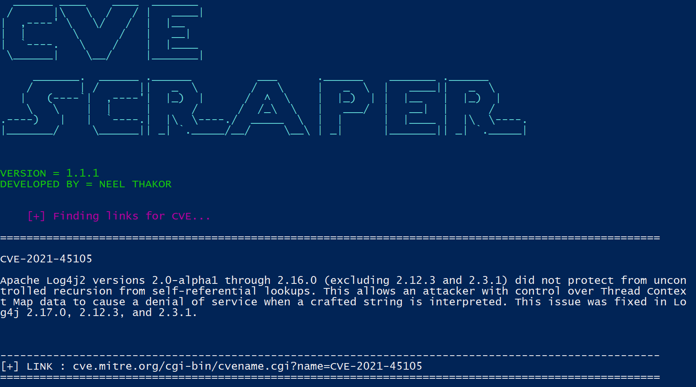

# CVE_Scraper

> Finds CVE from (https://cve.mitre.org/cve/search_cve_list.html) and give links.

The script will fetch the links of CVE for you, based on your keyword of CVE number.Enter whatever you want to find any CVE and the script will give you links from CVE mitre with it's basic discription.

## Usage

You need to have Python version 3.4+

```bash
sudo apt-get install python3
```

For downloading this tool...

```bash
git clone https://github.com/neelthakor21/CVE_Scraper.git
```

## Syntax

```bash
CVE_scrap.py -n NUMBER
```
NUMBER -> give the cve number.It takes CVE number and give perticular link of that CVE.

OR

```bash
CVE_scrap.py -q QUERY
```
QUERY -> give the keyword related the CVE.It takes keyword about CE and search and give numbers of links of CVEs related that keyword.

## Examples

```bash
CVE_scrap.py -n CVE-2021-44228
```
```bash
CVE_scrap.py -q log4j
```

## Output



----------------------------------------------------------------------------------------------------------------------------------------------------------------------
**Please report functionality issues and bugs if found.**  
> ## License
> [GNU Affero General Public License v3.0](https://www.gnu.org/licenses/agpl-3.0.en.html)
